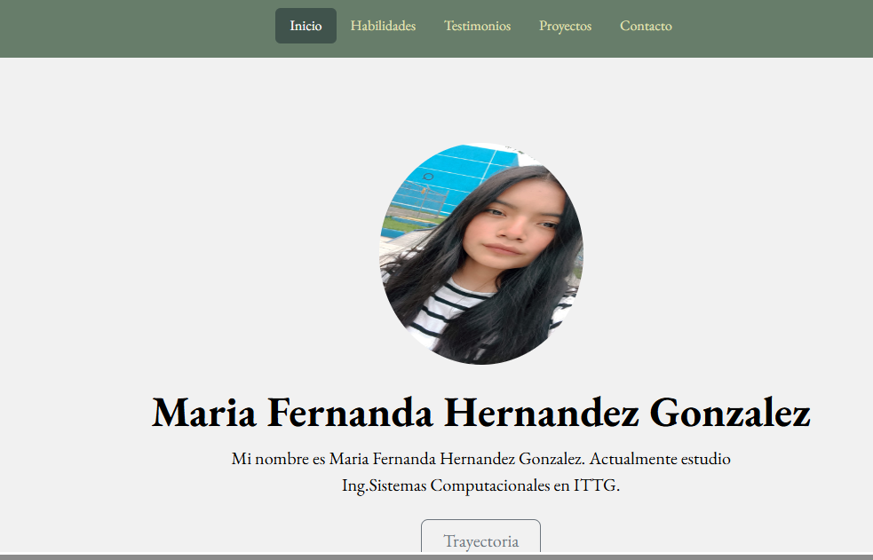

# Portafolio Maria Fernanda Hernandez Gonzalez
## Proyecto responsivo realizado con Bootstrap 5

Proyecto creado durante el bootcamp de Tecnolochicas PRO, es adaptable a distintos dispositivos o tamaños de pantalla.
El proposito de esta pagina web es mostrar mi portafolio de proyectos como desarrolladora de web.

Podrás encontrarlo aquí [Portafolio](https://github.com/fer44605)💜

### Tecnologias 

* HTML
* CSS
* Bootstrap 5
* JAVASCRIPT

### El proyecto cuenta con las siguiente secciones:

* Sobre mi
* Habilidades
* Proyectos
* Contacto

### Captura del proyecto

